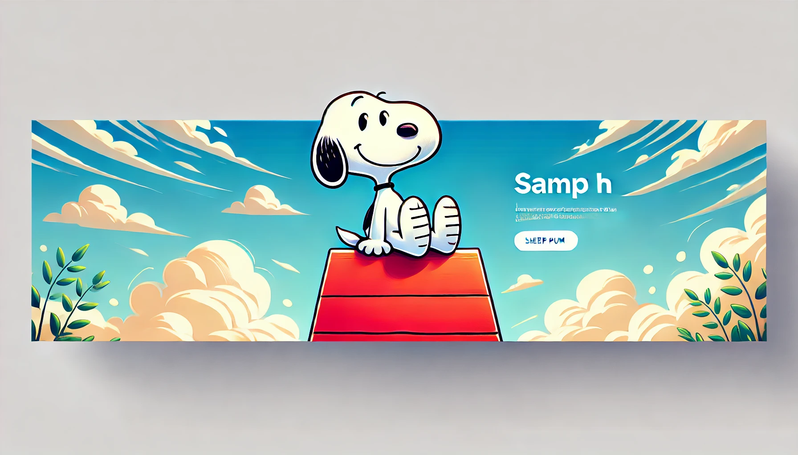

# 

<!DOCTYPE html>
<html lang="es">

<head>
    <meta charset="UTF-8">
    <meta name="viewport" content="width=device-width, initial-scale=1.0">
    <title>Mi Perfil Profesional</title>
    
</head>

<body>
    <!-- Incluye jQuery -->
    

    <!-- Encabezado -->
    <header class="header">
        <h1>Francesca Castillo</h1>
    </header>

    

        <!-- "Sobre Mí" -->
        <section id="about" class="about">
            
            <h2>Sobre Mí</h2>
            
¡Hola! 👋 Soy una estudiante de Ingeniería en Informática de Chile. Apasionada por el desarrollo de 
                software, bases de datos y el desarrollo web. Disfruto de enfrentar nuevos retos y aprender algo 
                nuevo cada día.
 
            <!-- Botón para descargar mi curriculum--->
            <a href="image/curricul actual fran.pdf" class="cv-button" download="Mi_Curriculum">Descargar CV</a>
        </section>

        <!-- Habilidades -->
        <section id="skills" class="skills">
            <h2>Habilidades Técnicas</h2>
            <ul class="skills-list">
                <li>HTML5</li>
                <li>CSS3</li>
                <li>JavaScript</li>
                <li>Python</li>
                <li>MySQL</li>
                <li>React</li>
                <li>Git</li>
                <li>Google Cloud</li>
                <li>Oracle</li>
            </ul>
        </section>
    

    <!-- Pie de página -->
    <footer>
        
Contacto: <a href="francesca.castillo25@gmail.com">francesca.castillo25@gmail.com</a>

    </footer>

    
</body>

</html>
